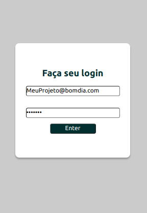
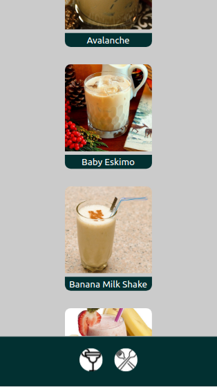

# Boas vindas ao repositório do projeto App-Recipes!

Este projeto foi desenvolvido por mim e meu grupo durante o curso de desenvolvimento web da Trybe.

Esta projeto é uma aplicação para ajudar a pessoas no hobby de cozinhar, nela poderá ver varias receitas, entre refeições e bebidas, ver videos de seu preparo, marcar os ingredientes que possui, marca-la como iniciada e favoritar as receitas em seu perfil. 

Essa aplicação foi feita em React e usa os dados de duas api's, `TheMealDB API` e `The CockTailDB API`, para trazer os dados de varias receitas entre comidas e bebidas para a aplicação que irão ser utilizadas para montar a página em uma apresentação front-end.

# A aplicação App-Recipes
    

A aplicação se desenrola toda no front-end e toda a aplicação usa o React, o CSS e os componentes foram pensados para formato de telas mobile.

    
A aplicação inicia com a "<strong>tela de Login</strong>"

O login deve ter:
- o usuario deverá digitar um e-mail valido, que deve estar no formato: `@algo.algo`.
- a senha deve ter mais de 6 caracteres.
 

Após o login, o usuario será redirecionado para a aplicação, para a "<strong>tela de refeições</strong>".

 
Na parte inferior da tela temos a possibilidade de trocar entre receitas de `refeições` e `bebidas`.

Ao selecionar uma receita será direcionado para a sua tela de detalhes. Nela poderá copiar, favoritar, ver a descrição da receita, ver videos de outras receitas e sugestões de bebidas.
    
    

 
Ao clicar "<strong>start recipe</strong>" irá pode marcar e os ingredientes necessarios para a receita e após marcar todos quando tiver terminado seu preparo clicar em <strong>finalize recipe</strong>.

 
 
Ao finalizar uma receita ela ficará no seu profile como done recipes ao lado das receitas favor 
    
    
    
 
 
# As Rotas da Aplicação

As rotas utilizadas na aplicação devem ser as seguintes:

- Tela de login: /;
- Tela principal de receitas de comidas: /foods;
- Tela principal de receitas de bebidas: /drinks;
- Tela de detalhes de uma receita de comida: /foods/{id-da-receita};
- Tela de detalhes de uma receita de bebida: /drinks/{id-da-receita};
- Tela de receita em progresso de comida: /foods/{id-da-receita}/in-progress;
- Tela de receita em progresso de bebida: /drinks/{id-da-receita}/in-progress;
- Tela de perfil: /profile;
- Tela de receitas feitas: /done-recipes;
- Tela de receitas favoritas: /favorite-recipes.

# Orientações de INSTALAÇÃO DO PROJETO

  1. Clone o repositório
  - Entre na pasta que deseja instalar no terminal.
  - Use o comando: `git clone git@github.com:th-maia/app-recipes.git`.
  - Entre na pasta do repositório que você acabou de clonar:
    - `cd app-recipes`

  2. Instale as dependências

  - Para isso, use o seguinte comando: `npm install`, 
      caso dê algum erro tente rodar novamente o comando acima, pode ocorrer por diferentes versões ou pacotes que foram instalados após outros.
  
  3. rode o comando para iniciar a aplicação: `npm start`
 

  4. quando quiser parar a aplicação, finalize no terminal apertando `ctrl+c`

